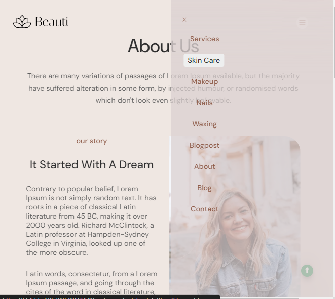
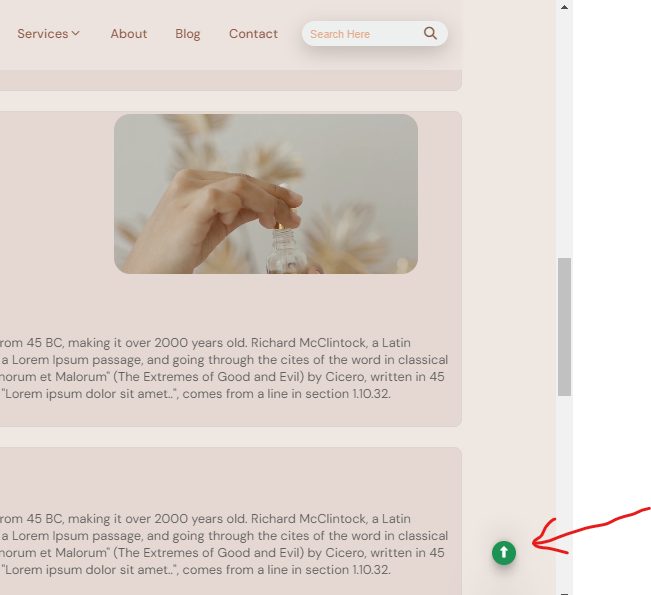
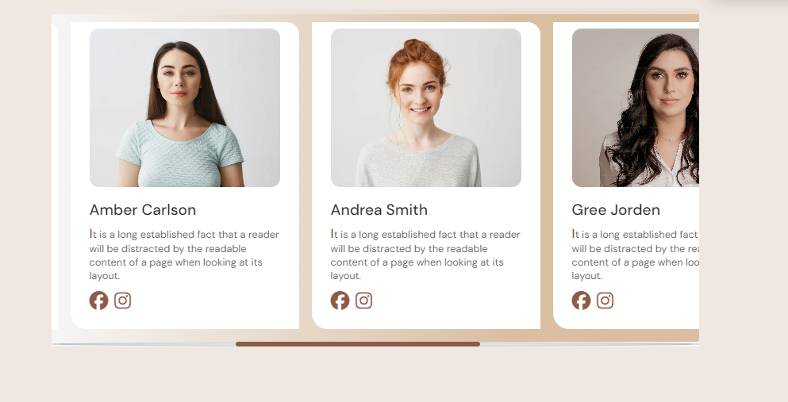

# Business website (DEMO)

### Short list:
1. Dropdown menu
2. menu-bar
    - fixed play
    - navbar
    - dropdown rotate icon 
3. slide menu bar(responsive)
4. card slider image (easy)
5. Toggle 
6. map
7. responsive 
    - max-width(1400)
    - max-width(1280)
    - max-width(990)
    - max-width(780)
    - max-width(600)

https://github.com/SUMITSARKAR89/sumitsarkar89/assets/127943920/fb884c79-9e00-48c8-b9ae-e26eb650c84a

### Dropdown menu


```html
<nav>
    <ul>
        <li class="dropdown">
            <a href="" class="dropbtn">services 
                <i class="fa-solid fa-chevron-down "></i></a>
            <div class="dropdown-content">
                <a href="">skin care</a>
                <a href="">makeup</a>
                <a href="">nails</a>
                <a href="">waxing</a>
            </div>
        </li>
        <li><a href="">about</a></li>
        <li><a href="">blog</a></li>
        <li><a href="">contact</a></li>
     </ul>      
</nav>
```
```css
  li.dropdown {
    display: inline-block;
  }
 .dropbtn {
    display: inline-block;
    
  }
  .dropdown-content {
    display: none;
    position: absolute;
    z-index: 1; 
  }
   .dropdown:hover .dropdown-content {
    display: block;
  }

```

### Menubar


```html
<nav id="sidebar">
    <ul>
        <li onclick=crossbar()><a href="#"><i class="fa-regular fa-x on"></i></a></li>
        <li><a href="" >services </a></li>
        <li><a href="" >skin care </a></li>
        <li><a href="" >makeup </a></li>
        <li><a href="" >nails </a></li>
        <li><a href="" >waxing </a></li>
        <li><a href="" >blogpost </a></li>
        <li><a href="">about</a></li>
        <li><a href="">blog</a></li>
        <li><a href="">contact</a></li>
                
    </ul>      
</nav>
<nav>
    <ul>
        <li class="dropdown">
            <a href="" class="dropbtn">services 
                <i class="fa-solid fa-chevron-down "></i></a>
            <div class="dropdown-content">
                <a href="">skin care</a>
                <a href="">makeup</a>
                <a href="">nails</a>
                <a href="">waxing</a>
            </div>
        </li>
        <li><a href="">about</a></li>
        <li><a href="">blog</a></li>
        <li><a href="">contact</a></li>
     </ul>      
</nav>
<div id="menu-btn" onclick=menuBar()>
    <i class="fa-solid fa-bars"></i>
</div>  
```

```css
#menu-btn{
    display: none;
}
#sidebar{
    position: fixed;
    top: 0;
    right: 0;
    height: 100vh;
    width: 250px;
    z-index: 10001;
    display: none;
}
#sidebar ul li a:hover{
    background-color: var(---white-color);
  }

*/respomsive
@media(max-width:780px){
  nav ul {
    display: none;  
  }
  #menu-btn{
        display: block;
      }  
}

```

```javaScript
function menuBar(){
    const sidebar = document.querySelector("#sidebar");
    sidebar.style.display = "flex";
}
function crossbar(){
    const sidebar = document.querySelector("#sidebar");
    sidebar.style.display = "none";

}

```

### Toggle scroll



```html
 <div class="toggle">
    <a href="index.html"> 
        <i class="fa-solid fa-up-long"></i>
    </a>
</div>
```

```css
.toggle{
  position: fixed;
  width: 30px;
  height: 30px;
  background-color: #1d9252;
  bottom: 50px;
  right: 50px;
}
```

### Image slider


```html
<div id="team-container" >
    <div class="team-card">
        make your slider
    </div>
</div>

```

```css
.team-container{
    max-width: 1020px;
    scroll-snap-type: x mandatory;
    overflow-x: scroll;
    scroll-padding: 30px;
  }
  .team-container .team-card{
    scroll-snap-align: start;
  }
   .team-container::-webkit-scrollbar-track{
	-webkit-box-shadow: inset 0 0 6px rgba(0,0,0,0.3);
	background-color: #F5F5F5;
  border-radius: 50%;
}

.team-container::-webkit-scrollbar{
	height: 8px;
	background-color: #F5F5F5;
}

.team-container::-webkit-scrollbar-thumb{
	background-color:var(---btn-color); 
    border-radius: 5px;
}
::-webkit-scrollbar-thumb:hover {
  background: #92351d; 
}

```


